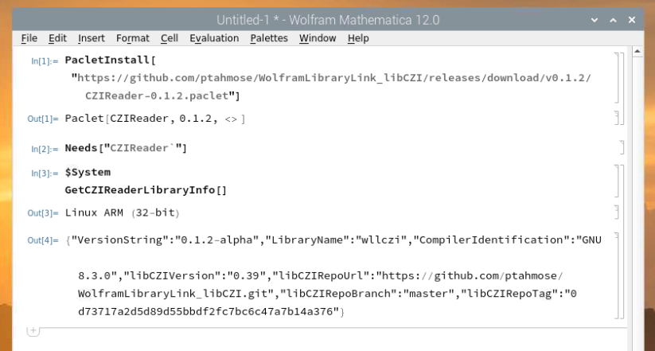

# WolframLibraryLink_libCZI

read [CZI-documents](https://www.zeiss.com/microscopy/int/products/microscope-software/zen/czi.html) from [Mathematica](https://www.wolfram.com/mathematica) / [Wolfram Language](https://www.wolfram.com/language/)

# Description

This project provides a [Wolfram Library Link](https://reference.wolfram.com/language/LibraryLink/tutorial/Overview.html) implementation (based on [libCZI](https://github.com/ptahmose/libCZI)) allowing to directly open and read a CZI-document.

# Installing

A Paclet is provided which includes binaries for ARM (e.g. Raspberry Pi), Windows x86 & x64 and Linux x64 on the [release-page](https://github.com/ptahmose/WolframLibraryLink_libCZI/releases) here on GitHub.

